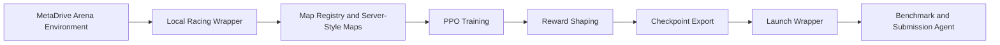

# MetaDrive Racing RL

Reinforcement learning experiments for multi-agent racing in the MetaDrive environment, focused on training competitive continuous-control racing agents and evaluating them against scripted and learned opponents.

This project is built around the MetaDrive / MetaDrive Arena ecosystem:

- MetaDrive Arena: https://github.com/VAIL-UCLA/MetaDrive-Arena

## Project Summary

This repository contains a full training and evaluation pipeline for MetaDrive racing. The final approach in this repository placed 5th out of 70 students in the course competition.

The repository includes:

- local racing environments and map definitions
- reconstructed evaluation-style maps for local testing
- PPO training and evaluation code
- opponent-pool and self-play infrastructure
- utilities for exporting self-contained submission agents

## PPO Objective

This project uses Proximal Policy Optimization as the base training algorithm. PPO was kept as the main optimizer because the largest gains came from better task formulation, reward shaping, and evaluation rather than from replacing the algorithm itself.

The PPO policy ratio is:

```math
r_t(\theta) = \frac{\pi_\theta(a_t \mid s_t)}{\pi_{\theta_{\mathrm{old}}}(a_t \mid s_t)}
```

The clipped PPO objective is:

```math
L^{\mathrm{CLIP}}(\theta) =
\mathbb{E}_t \left[
\min\left(
r_t(\theta)\hat{A}_t,\;
\mathrm{clip}(r_t(\theta), 1-\epsilon, 1+\epsilon)\hat{A}_t
\right)
\right]
```

The full optimization target also includes a value loss and an entropy bonus:

```math
L(\theta) =
L^{\mathrm{CLIP}}(\theta)
- c_v L^{\mathrm{VF}}(\theta)
+ c_e \mathbb{E}_t[\mathcal{H}(\pi_\theta(\cdot \mid s_t))]
```

In this repository, PPO was combined with:

- larger actor / critic networks
- linear learning-rate decay
- low-entropy training for less hesitant control
- pace-oriented reward shaping
- track-guidance reward shaping during training

## Workflow



## Repository Structure

The Python source code is organized under `src/`. The repository root keeps a few short entrypoints so the main commands stay simple.

- `src/train.py`
  - PPO training entrypoint
  - supports map splits, reward shaping, frame stacking, self-play, and resumed training
- `src/env.py`
  - single-agent wrapper around MetaDrive multi-agent racing
  - contains reward shaping and optional track-guidance shaping
- `src/racing_maps.py`
  - local track definitions
  - includes default maps and reconstructed evaluation-style maps
- `src/map_splits.py`
  - train / validation / test / server map groupings
- `src/opponents.py`
  - scripted and learned opponent loading helpers
- `src/eval_local.py`
  - direct local evaluation against scripted or learned agents
- `src/benchmark.py`
  - repeatable benchmark runner with JSON summaries
- `src/track_guidance.py`
  - reference-line progress and line-alignment helpers used for training-time shaping

## Environment Setup

Create the conda environment:

```bash
conda env create -f environment.yml
conda activate cs260r_miniproject
```

If needed, install directly from `requirements.txt`:

```bash
pip install -r requirements.txt
```

## Training

Basic training run:

```bash
python train.py --total-timesteps 2000000
```

Example server-focused training run:

```bash
python train.py \
  --run-name example_server_run \
  --export-agent-dir agents/agent_example_server_run \
  --total-timesteps 2000000 \
  --num-train-envs 8 \
  --num-eval-envs 2 \
  --train-map-split server \
  --eval-map-split server \
  --opponent-pool still random \
  --pi-layers 512 256 \
  --vf-layers 512 256 \
  --lr 3e-4 \
  --lr-schedule linear \
  --n-steps 512 \
  --batch-size 256 \
  --n-epochs 10 \
  --clip-range 0.2 \
  --gamma 0.99 \
  --gae-lambda 0.95 \
  --vf-coef 0.5 \
  --max-grad-norm 0.5 \
  --target-kl 0.03 \
  --ent-coef 0.005 \
  --progress-reward-weight 10.0 \
  --early-reward-horizon 300 \
  --early-progress-weight 70.0
```

## Benchmarking

Direct benchmark examples:

```bash
python benchmark.py \
  --agent-dir agents/agent_example_server_run \
  --map-split server \
  --opponent-preset learned

python benchmark.py \
  --agent-dir agents/agent_example_server_run \
  --map-split server \
  --opponent-preset full
```

The benchmark summaries include metrics such as:

- `win_rate`
- `arrival_rate`
- `route_completion`
- `speed`
- `route@100`
- `speed@100`
- `arrival_step`

## Local Evaluation

Evaluate a trained agent directly:

```bash
python eval_local.py --agent-dirs agents/agent_example_server_run
python eval_local.py --agent-dirs agents/agent_example_server_run agents/example_agent --mode versus
python eval_local.py --agent-dirs agents/agent_example_server_run agents/example_agent --mode versus --map server_map1
```
